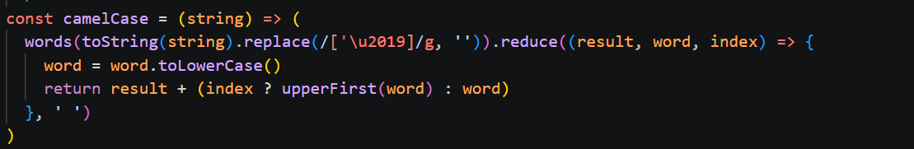
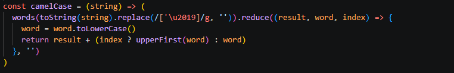

# camelCase

## Yhteenveto / Summary
> camelCase funktio oli initoitu alkamaan " ", joten jokaista palautettua arvoa edelsi tyhjä välimerkki.

## Tyyppi / Type
- [X] Bugi / Bug
- [ ] Parannusehdotus / Improvement
- [ ] Uusi ominaisuus / Feature
- [ ] Dokumentaatio / Documentation

## Vakavuus / Severity
- [ ] ❌ Kriittinen / Critical
- [ ] ⚠️ Vakava / Major
- [X] ⚪ Vähäinen / Minor

## Korjaus / Fix
> Muutettiin " " --> ""

**Odotettu tulos / Expected Result:**  
> 'fooBar'

**Todellinen tulos / Actual Result:**  
> ' fooBar'

## Liitteet / Attachments

## Ympäristö / Environment
- Käyttöjärjestelmä / OS:  Windows 11

## Lisätiedot / Additional Notes
> Ongelma korjattu repositoryssa olevassa tiedostossa