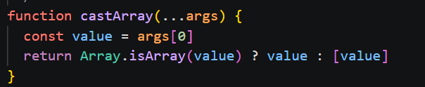
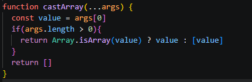

# castArray

## Yhteenveto / Summary
> castArray-funktion oli tarkoitus palauttaa tyhjä lista, jos parametreja ei syötetty. Funktio palautti [undefined].

## Tyyppi / Type
- [X] Bugi / Bug
- [ ] Parannusehdotus / Improvement
- [ ] Uusi ominaisuus / Feature
- [ ] Dokumentaatio / Documentation

## Vakavuus / Severity
- [ ] ❌ Kriittinen / Critical
- [X] ⚠️ Vakava / Major
- [ ] ⚪ Vähäinen / Minor

## Korjaus / Fix
> Lisättiin koodiin tarkistus: 'if args.length > 0', jos epätosi - palautetaan tyhjä lista.

**Odotettu tulos / Expected Result:**  
> '[]'

**Todellinen tulos / Actual Result:**  
> ' [undefined]'

## Liitteet / Attachments
### Original

### Fixed

## Ympäristö / Environment
- Käyttöjärjestelmä / OS:  Windows 11

## Lisätiedot / Additional Notes
> Ongelma korjattu repositoryssa olevassa tiedostossa