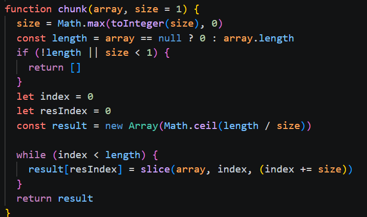
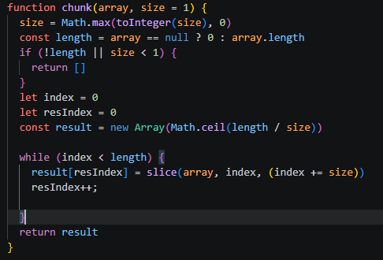

# chunk

## Yhteenveto / Summary
> chunk() -funktio ei muodostanut taulukoita halutulla tavalla, syynä oli se, että resIndexiä ei kasvatettu kun lista luotiin.
> Myös slice()- funktiossa vika

## Tyyppi / Type
- [X] Bugi / Bug
- [ ] Parannusehdotus / Improvement
- [ ] Uusi ominaisuus / Feature
- [ ] Dokumentaatio / Documentation

## Vakavuus / Severity
- [ ] ❌ Kriittinen / Critical
- [X] ⚠️ Vakava / Major
- [ ] ⚪ Vähäinen / Minor

## Korjaus / Fix
> Lisättiin resIndex++ while loopin sisään

**Odotettu tulos / Expected Result:**  
> '['a', 'b', 'c'], ['d']'

**Todellinen tulos / Actual Result:**  
> '['a' 'b'], ['b', 'c'], ['c', 'd'] ['d']

## Liitteet / Attachments

## Ympäristö / Environment
- Käyttöjärjestelmä / OS:  Windows 11

## Lisätiedot / Additional Notes
> Ongelma korjattu repositoryssa olevassa tiedostossa