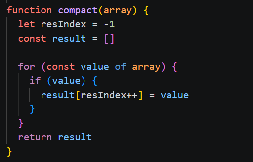
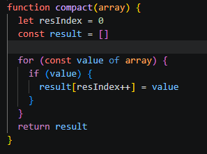

# compact

## Yhteenveto / Summary
> compact() -funktiolla on arvo resIndex, joka määrää mihin paikkaan listaa alkiot sijoitetaan. Oli alustettu -1 --> listan rangen ulkopuolella.

## Tyyppi / Type
- [X] Bugi / Bug
- [ ] Parannusehdotus / Improvement
- [ ] Uusi ominaisuus / Feature
- [ ] Dokumentaatio / Documentation

## Vakavuus / Severity
- [ ] ❌ Kriittinen / Critical
- [X] ⚠️ Vakava / Major
- [ ] ⚪ Vähäinen / Minor

## Korjaus / Fix
> Alustettiin resIndex arvoksi 0

**Odotettu tulos / Expected Result:**  
> '[1, 2, 3]'

**Todellinen tulos / Actual Result:**  
> '[2, 3]'

## Liitteet / Attachments
### Original

### Fixed

## Ympäristö / Environment
- Käyttöjärjestelmä / OS:  Windows 11

## Lisätiedot / Additional Notes
> Ongelma korjattu repositoryssa olevassa tiedostossa