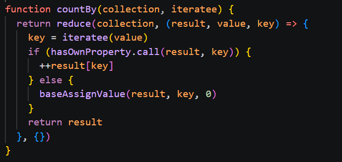
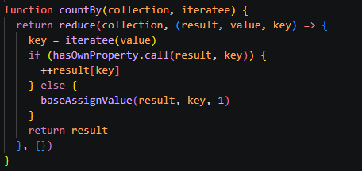

# countBy

## Yhteenveto / Summary
> countBy() -funktiolla etsittiin tiettyjen arvojen esiintymistä objektissa. Jos arvoa ei vielä oltu lisätty listaan, lisättiin uusi arvo listaan arvolla 0.

## Tyyppi / Type
- [X] Bugi / Bug
- [ ] Parannusehdotus / Improvement
- [ ] Uusi ominaisuus / Feature
- [ ] Dokumentaatio / Documentation

## Vakavuus / Severity
- [ ] ❌ Kriittinen / Critical
- [X] ⚠️ Vakava / Major
- [ ] ⚪ Vähäinen / Minor

## Korjaus / Fix
> Kun arvo löytyi, lisättiin löytymisten arvoksi 1 nollan sijaan 

**Odotettu tulos / Expected Result:**  
> '{ 'true': 2, 'false': 1 }'

**Todellinen tulos / Actual Result:**  
> '{ 'true': 1, 'false': 0 }'

## Liitteet / Attachments
### Original

### Fixed

## Ympäristö / Environment
- Käyttöjärjestelmä / OS:  Windows 11

## Lisätiedot / Additional Notes
> Ongelma korjattu repositoryssa olevassa tiedostossa