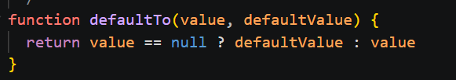
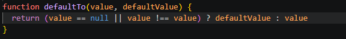

# defaultTo

## Yhteenveto / Summary
> defaultTo() -funktion pitäisi palauttaa defaultValue arvoilla 'NaN', 'null', 'undefined'. Parametrilla NaN funktio palautti arvon NaN

## Tyyppi / Type
- [X] Bugi / Bug
- [ ] Parannusehdotus / Improvement
- [ ] Uusi ominaisuus / Feature
- [ ] Dokumentaatio / Documentation

## Vakavuus / Severity
- [ ] ❌ Kriittinen / Critical
- [X] ⚠️ Vakava / Major
- [ ] ⚪ Vähäinen / Minor

## Korjaus / Fix
> Lisättiin funktion vertailuun ehto || value !== value, tällä otettiin NaN-arvot kiinni

**Odotettu tulos / Expected Result:**  
> 'defaultValue'

**Todellinen tulos / Actual Result:**  
> 'NaN'

## Liitteet / Attachments

## Ympäristö / Environment
- Käyttöjärjestelmä / OS:  Windows 11

## Lisätiedot / Additional Notes
> Ongelma korjattu repositoryssa olevassa tiedostossa