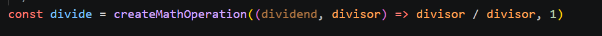
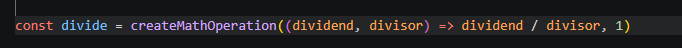

# divide
## Yhteenveto / Summary
> divide() -funktiossa oli kaksi ongelmaa. Funktio sai kaksi parametria didend, divisor, laskutoimitus tapahtui divisor/divisor.
> Myöskään nollalla jakoa ei tarkistettu.

## Tyyppi / Type
- [X] Bugi / Bug
- [ ] Parannusehdotus / Improvement
- [ ] Uusi ominaisuus / Feature
- [ ] Dokumentaatio / Documentation

## Vakavuus / Severity
- [X] ❌ Kriittinen / Critical
- [ ] ⚠️ Vakava / Major
- [ ] ⚪ Vähäinen / Minor

## Korjaus / Fix
> Muutettiin divisor / divisor --> dividend / divisor.
> Muutettiin toiseksi parametriksi 0 sijaan 1, ei kaada sovellusta vaan palauttaa Infinity.

**Odotettu tulos / Expected Result:**  
>  25 / 5 --> '5'

**Todellinen tulos / Actual Result:**  
> 25 / 5 --> 1

## Liitteet / Attachments

## Ympäristö / Environment
- Käyttöjärjestelmä / OS:  Windows 11

## Lisätiedot / Additional Notes
> Ongelma korjattu repositoryssa olevassa tiedostossa