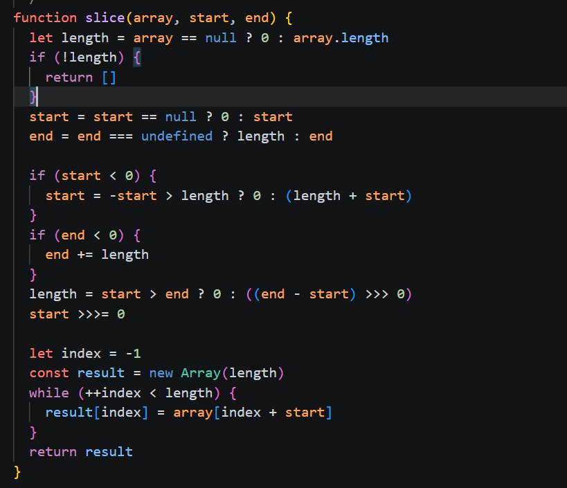
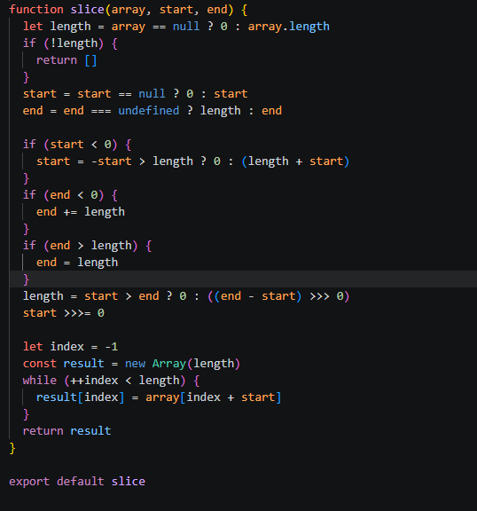

# slice
## Yhteenveto / Summary
> slice()- funktio ei toiminut chunk()- funktion kanssa. Syynä, että slice saattoi palauttaa liian pitkiä listoja (end-arvo liian suuri suhteessa todelliseen listan pituuteen). 

## Tyyppi / Type
- [X] Bugi / Bug
- [ ] Parannusehdotus / Improvement
- [ ] Uusi ominaisuus / Feature
- [ ] Dokumentaatio / Documentation

## Vakavuus / Severity
- [ ] ❌ Kriittinen / Critical
- [X] ⚠️ Vakava / Major
- [ ] ⚪ Vähäinen / Minor

## Korjaus / Fix
> Lisättiin vertailu if (end > length) {
>    end = length
>  }
**Odotettu tulos / Expected Result:**  
>  ['d']

**Todellinen tulos / Actual Result:**  
> ['d', undefined, undefined]

## Liitteet / Attachments
### Original

### Fixed

## Ympäristö / Environment
- Käyttöjärjestelmä / OS:  Windows 11

## Lisätiedot / Additional Notes
> Ongelma korjattu repositoryssa olevassa tiedostossa