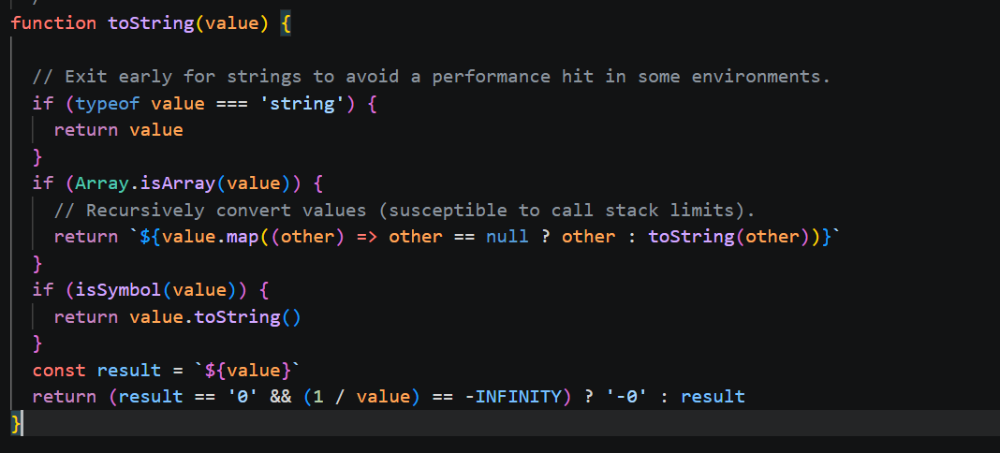
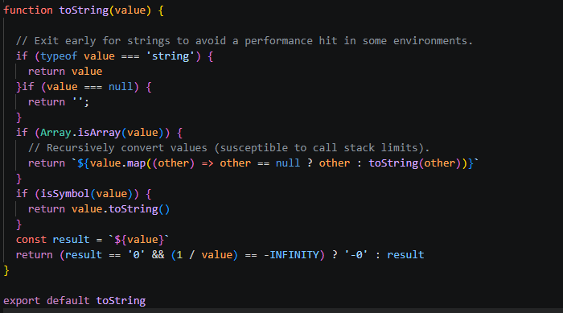

# toString
## Yhteenveto / Summary
> toString() -funktion olisi pitänyt palauttaa null-parametrilla tyhjä arvo. Palautti 'null'

## Tyyppi / Type
- [X] Bugi / Bug
- [ ] Parannusehdotus / Improvement
- [ ] Uusi ominaisuus / Feature
- [ ] Dokumentaatio / Documentation

## Vakavuus / Severity
- [ ] ❌ Kriittinen / Critical
- [ ] ⚠️ Vakava / Major
- [X] ⚪ Vähäinen / Minor

## Korjaus / Fix
> Koodiin lisätty ehtolause:
> if (value === null) {
>    return '';
>  }

**Odotettu tulos / Expected Result:**  
>  ''

**Todellinen tulos / Actual Result:**  
> 'null'

## Liitteet / Attachments
### Original

### Fixed

## Ympäristö / Environment
- Käyttöjärjestelmä / OS:  Windows 11

## Lisätiedot / Additional Notes
> Ongelma korjattu repositoryssa olevassa tiedostossa
